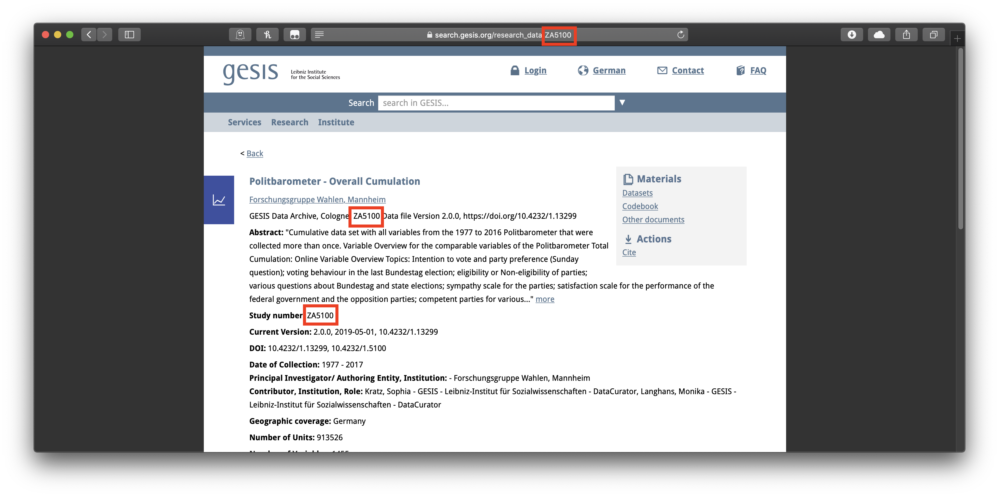

The [GESIS](https://search.gesis.org) Data Archive makes available thousands of invaluable social scientific surveys, including, among many others, the ALLBUS, the European Values Survey, the Eurobarometer, and the International Social Survey Program.  Researchers taking advantage of these datasets, however, are caught in a bind.  The archive's terms and conditions bar dissemination of downloaded datasets to third parties.  But to ensure that one's work can be reproduced, assessed, and built upon by others, one must provide access to the raw data one employed.  

The `gesisdata` package cuts this knot by providing programmatic, reproducible access to specified GESIS datasets from within R for [registered users](https://login.gesis.org/realms/gesis/account/). 
 

## Setup

When used interactively, the `gesis_download` function will ask for the login information required by GESIS: the registered user's email, password, and the use to which the data will be put. 
After that information is input once, it will be entered automatically for any other download requests made in the same session.  To change this contact information within a session, one may set the argument `reset` to `TRUE` when running `gesis_download` again, and the function will again request the required information. 

An optional, but highly recommended, setup step is to add the information that GESIS requires to your [.Rprofile](https://www.statmethods.net/interface/customizing.html) as in the following example:

```{r eval = FALSE}
options("gesis_email" = "juanita-herrara@uppermidwest.edu",
        "gesis_password" = "password123!",
        "gesis_use" = 5)
```

The `gesis_download` function will then access the information it needs to pass on to GESIS by default.  This means that researchers will not have to expose their info in their R scripts and that others reproducing their results later---given that they have registered as users with GESIS---will be able to execute those R scripts without modification.  (They will, however, need to enter their own information either interactively or in their own .Rprofiles, a detail that should be noted in the reproducibility materials to avoid confusion.)


## Use
The `gesis_download` function (1) simulates a visit to the GESIS log-in page, (2) enters the required information to sign in, (3) navigates to a specified dataset and downloads the dataset's files, and, optionally but by default, (4) converts the dataset's Stata-formated files to `.Rdata` format.

Datasets are specified using the `file_id` argument.  GESIS uses a unique number to identify each of its datasets.  This number consistently appears alongside the dataset's name; it is also listed as the "Study Number," and it can be found at the end of the dataset's URL as well.  For the [cumulative Politbarometer](https://search.gesis.org/research_data/ZA5100), for example, the file id is ZA5100:



To reproducibly download this dataset:

```{r eval=FALSE}
gesis_download(file_id = "ZA5100",
               download_dir = tempdir()) # remember to specify a directory for your download
```

Multiple datasets may be downloaded from the same research area in a single command by passing a vector of ids to `file_id`.  The following downloads the Politbarometer cumulative file along with Eurobarometer 84.4 and the ISSP Role of Government V:

```{r eval=FALSE}
gesis_download(file_id = c("ZA5100", "ZA6644", "ZA6900"),
               download_dir = tempdir()) # remember to specify a directory for your download
```

After the needed datasets (and, if available, their codebooks) are downloaded, the datasets are by default converted to `.RData` format and ready to be loaded into R using `load()` or `rio::import()`.

```{r eval=FALSE}
politbarometer <- rio::import(file.path(tempdir(), "ZA5100", "ZA55100_v2-0-0.RData"))
```
